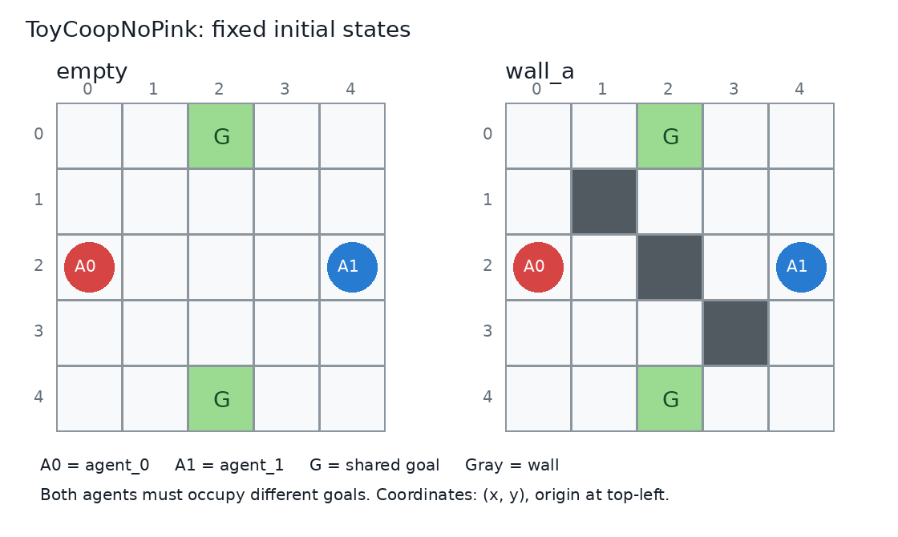

# ToyCoopNoPink checkpoint audit (2026-09-19)

All 72 requested final checkpoints exist: seeds 0-5 for each of 12
algorithm/batch/layout groups. Another 12 final checkpoints are seed 98
training-time XP partners. IPPO and E3T each have separate fixed-map training
runs for empty and wall_a. CEC and IDAAC+CEC each have one mixed-layout policy
per seed and batch size. `IDAAC` is the spelling used in this repository.

## Evidence and limits

- [checkpoints.csv](checkpoints.csv): exact file paths, sizes, parameter hashes,
  array checks, convolution shapes, update counts, and matched historical configs.
- [summary.json](summary.json): counts by algorithm, batch size, and map.
- All 196 included final/best/progress files could be decoded as numerical
  arrays with a restricted NumPy reader. All parameter arrays were finite.
- The 72 target final policies have 72 distinct parameter hashes. Their input
  convolutions have four input channels, consistent with ToyCoopNoPink.
- Historical Hydra configs were found for 69 of 72 target final policies.
  Missing: CEC 64 seeds 0, 1, 2 (and the additional seed 98 partner).
  Their paths, update counts and four-channel parameters are consistent with
  the claimed group, but do not prove the original environment/reset/held-out
  settings. No historical configs were fabricated or replaced with current YAML.
- All available target configs specify ToyCoopNoPink, NUM_STEPS=100,
  TOTAL_TIMESTEPS=MAX_TRAIN_STEPS=1e8. NUM_ENVS=256 gives 3906 updates
  (99,993,600 transitions); NUM_ENVS=64 gives 15625 (100,000,000 transitions).
- JAX and Flax are not installed in this audit interpreter. Native model
  loading, forward passes and environment rollouts were not executed.
  The restricted reader maps serialized JAX arrays to NumPy and FrozenDict
  containers to dictionaries solely for inspection.

## Checkpoint roots

All paths below are relative to the repository. Each root contains dated
`lr-*` run directories. Each has final checkpoints for seeds 0-5 plus seed 98.

| Algorithm | NUM_ENVS | Training map | Root |
| --- | ---: | --- | --- |
| IPPO | 64 | empty | `ckpts/ippo/ToyCoopNoPink/modified_wall/empty/ikFalse/reset_all/ippo_layout_eval/` |
| IPPO | 64 | wall_a | `ckpts/ippo/ToyCoopNoPink/modified_wall/wall_a/ikFalse/reset_all/ippo_layout_eval/` |
| IPPO | 256 | empty | `ckpts/ippo/ToyCoopNoPink/modified_wall/empty_with_xp_numenv256/ikFalse/reset_all/ippo_layout_eval/` |
| IPPO | 256 | wall_a | `ckpts/ippo/ToyCoopNoPink/modified_wall/wall_a_with_xp_numenv256/ikFalse/reset_all/ippo_layout_eval/` |
| E3T | 64 | empty | `ckpts/e3t/ToyCoopNoPink/modified_wall/empty/ikFalse/reset_all/e3t/` |
| E3T | 64 | wall_a | `ckpts/e3t/ToyCoopNoPink/modified_wall/wall_a/ikFalse/reset_all/e3t/` |
| E3T | 256 | empty | `ckpts/e3t/ToyCoopNoPink/modified_wall/empty_with_xp_numenv256/ikFalse/reset_all/e3t/` |
| E3T | 256 | wall_a | `ckpts/e3t/ToyCoopNoPink/modified_wall/wall_a_with_xp_numenv256/ikFalse/reset_all/e3t/` |
| CEC | 64 | mixed | `ckpts/ippo/ToyCoopNoPink/modified_wall/mixed_empty_wall_a_with_xp_numenv64/ikTrue/reset_all/cec_layout_eval/` |
| CEC | 256 | mixed | `ckpts/ippo/ToyCoopNoPink/modified_wall/mixed_empty_wall_a_with_xp_numenv256/ikTrue/reset_all/cec_layout_eval/` |
| IDAAC+CEC | 64 | mixed | `ckpts/idaac/ToyCoopNoPink/modified_wall/mixed_empty_wall_a_with_xp_numenv64/ikTrue/reset_all/` |
| IDAAC+CEC | 256 | mixed | `ckpts/idaac/ToyCoopNoPink/modified_wall/mixed_empty_wall_a_with_xp_numenv256/ikTrue/reset_all/` |

Final filenames: `seed{seed}_ckpt0_improved_updates{updates}.pkl` for IPPO,
CEC, and IDAAC+CEC; `seed{seed}_ckpt0_e3t_updates{updates}.pkl` for E3T.
Updates are 15625 for 64 and 3906 for 256. E3T also has
`seed{seed}_best_e3t.pkl`. IPPO has `seed{seed}_progress_33.pkl`,
`seed{seed}_progress_67.pkl`, and `seed{seed}_progress_100.pkl`.
IDAAC resume files were excluded from the parameter inspection.
The separately named `cec_popart_layout_eval` experiments are outside this audit.

## Fixed maps and environment



The figure is drawn from `ModifiedWallToyCoop.LAYOUTS` in
`jaxmarl/environments/toy_coop/modified_wall_toy_coop.py` (line 33).
Coordinates are (x, y), with (0, 0) at the upper-left. Both fixed maps start
agent_0 at (0, 2), agent_1 at (4, 2), and the two goals at (2, 0), (2, 4).
empty has no walls. wall_a adds walls at (1, 1), (2, 2), (3, 3).

ToyCoopNoPink has a 5x5 grid, two agents, and exactly two interchangeable goal
cells. There are no pink goals or other_goal_pos. Each agent observes self,
partner, goals and walls in four channels (flattened size 100); archived
configs use full observability. Actions are right, down, left, up, stay.
Walls and boundaries block movement; attempted same-cell collisions cancel
both moves. Both agents receive the same reward: +2 per step when they are
simultaneously on different goals, otherwise -1. Reward is evaluated after
movement and goal occupancy does not end the 100-step episode.
`incentivize_strat` is ignored by ToyCoopNoPink.

IPPO/E3T configs use random_reset=false and check_held_out=false, training
separate policies on the two fixed initial states. CEC/IDAAC+CEC use
random_reset=true, check_held_out=true, map_name=mixed and layouts
[empty, wall_a]. Each reset chooses one of these two wall patterns and
randomizes both agents and both goals across distinct free cells.
The wall pattern is chosen, not procedurally redrawn.

## What the 102 held-out entries mean

The training code builds 100 procedural initial states with
`custom_reset_fn(jax.random.key(i), random_reset=True)` for i=0,...,99, using
the mixed environment, then appends the fixed empty state and fixed wall_a
state shown above. This is 100 total random states, not 100 per layout,
and not 102 different wall maps. The generator has no uniqueness assertion;
the precise random bank and its unique-state count were not regenerated here.

Each entry consists of the ordered agent positions, unordered goal positions,
and wall map. The match uses all three together. Merely visiting a held-out
coordinate or using its wall layout does not constitute a match. Reversing
the two identical goals matches; reversing agent identities is not explicitly
matched. The exclusion is checked at reset, not during subsequent movement.

Sources: `modified_wall_ippo_general_dual_destination_with_xp.py:198`,
`modified_wall_idaac_general_gradient_with_xp.py:232`, and
`jaxmarl/environments/toy_coop/toy_coop_no_pink.py:51`.

Important: `ToyCoopNoPink.reset` (line 82) only resamples once after a held-out
match and does not check the replacement. Strict exclusion is therefore not
guaranteed. This is a code-level possibility of leakage, not evidence that
any particular training run encountered a held-out initial state.
No training code or existing checkpoints were changed by this audit.

## Evaluation selection caveat

`baselines/CEC_UED/modified_wall_procedural_xp_eval.py:80` currently resolves
IPPO and E3T from the untagged empty/wall_a directories (64 versions).
`xp_config/modified_wall_procedural_xp.yaml` defaults CEC_CKPT_TAG to
with_xp_numenv64 and IDAAC_CKPT_TAG to with_xp_numenv256. Thus running this
evaluator as-is mixes training batch sizes. IPPO/E3T do not currently have
equivalent tag handling in this loader.

That evaluator selects final E3T checkpoints, not best_e3t. Model availability
does not by itself ensure the evaluation script selects the intended version.

## Reproduce

From the repository root:

```bash
python3 docs/audits/toycoop_nopink_20260919/audit.py
```

Requires NumPy, PyYAML and Pillow. It only reads checkpoints/configs/source
and regenerates checkpoints.csv, summary.json and fixed_maps.png here.
